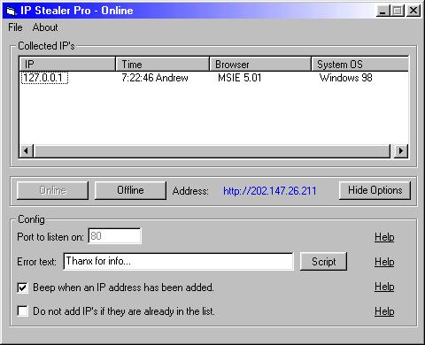



## IP Stealer Pro \- Get more than the IP\.\.\.

### Description

My code will retreive the IP Address of any user connecting to your IP via WWW. It will also get the Operating System version, and Browser info!
 
### More Info
 

             |
---                |---
**Submitted On**   |2000-04-17 19:17:50
**By**             |[Andrew A](https://github.com/Planet-Source-Code/PSCIndex/blob/master/ByAuthor/andrew-a.md)
**Level**          |Intermediate
**User Rating**    |4.5 (18 globes from 4 users)
**Compatibility**  |VB 5\.0, VB 6\.0
**Category**       |[Internet/ HTML](https://github.com/Planet-Source-Code/PSCIndex/blob/master/ByCategory/internet-html__1-34.md)
**World**          |[Visual Basic](https://github.com/Planet-Source-Code/PSCIndex/blob/master/ByWorld/visual-basic.md)
**Archive File**   |[CODE\_UPLOAD48824172000\.zip](https://github.com/Planet-Source-Code/andrew-a-ip-stealer-pro-get-more-than-the-ip__1-7341/archive/master.zip)

